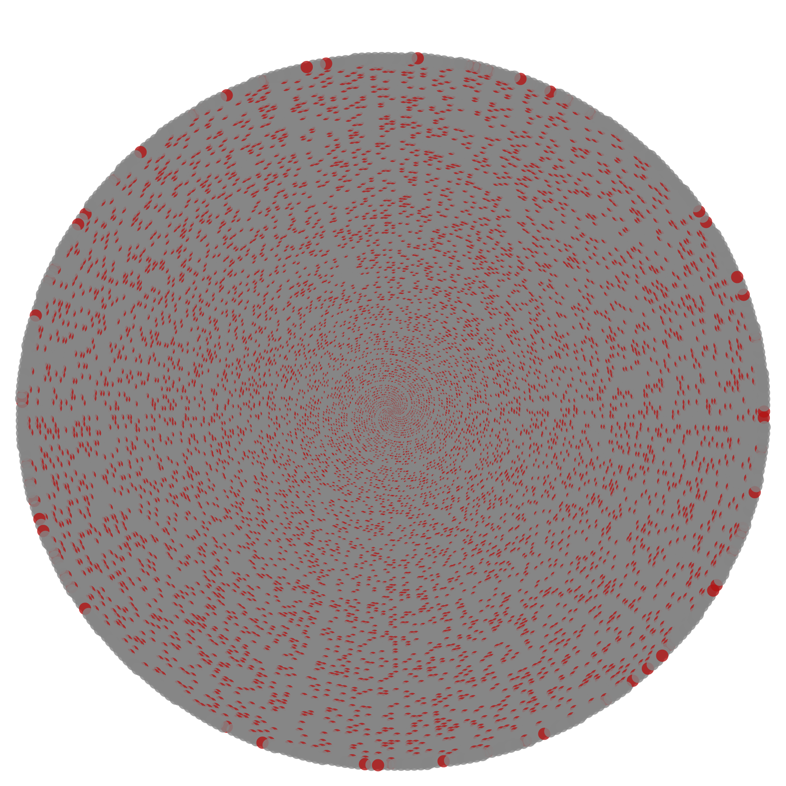

# Beauty of Numbers

> Студия математического искусства: превращает числовые последовательности — в первую очередь простые числа — в изображения.
>
> A math-art studio that turns number sequences — primes first — into images.

Русский | [English ↓](#english)



---

## Русский

### Что это

Beauty of Numbers — десктопное приложение (WPF, .NET 8) для генерации изображений из чисел. Каждое число `n` получает точку на плоскости, а классификатор (простое / составное) задаёт её цвет. Основа проекта — семейство спиральных раскладок: архимедова, Улам, Сакс, гексагональная.

Формула продукта:

**Последовательность × Раскладка × Стиль → Пресет → Экспорт**

### Статус

Фундамент M0 готов: решение разделено на `Core / Rendering / Cli / App.Wpf`, математика живёт в ядре, есть тесты и CI. Следующая веха — M1 (рендер на SkiaSharp, живое превью) — см. [roadmap](docs/01-product/roadmap.md).

### Возможности (сейчас)

- Архимедова спираль (`r = n`, `θ = n`); диапазон задаётся как `[Start, Start + Count)` (в M0: count до 100 000, конец диапазона до 100 000 000).
- Решето Эратосфена в ядре; простые числа подсвечиваются отдельным цветом, фильтр «только простые» — чекбокс в студии и `--only-primes` в CLI.
- WPF-студия: диапазон, цвета, размер точек, зум превью, сохранение PNG (превью пока через временный файл — это снимется в M1).
- CLI: одиночный рендер PNG; пресеты и пакетный рендер — M3.

### Быстрый старт

Требуется .NET 8 SDK.

```powershell
dotnet build BeautyOfNumbers.sln
dotnet run --project src/BeautyOfNumbers.App.Wpf   # студия (WPF)
dotnet run --project src/BeautyOfNumbers.Cli       # CLI: plot.png в рабочей папке
dotnet test                                        # тесты ядра
```

### Структура репозитория

| Путь | Назначение |
| --- | --- |
| `src/BeautyOfNumbers.Core/` | ядро: диапазон, классификаторы простоты, раскладки, стиль, запросы, валидация, пресеты; без внешних зависимостей |
| `src/BeautyOfNumbers.Rendering/` | рендер PNG (временно OxyPlot; в M1 — SkiaSharp) |
| `src/BeautyOfNumbers.Cli/` | консольный рендер |
| `src/BeautyOfNumbers.App.Wpf/` | WPF-студия (MVVM) |
| `tests/BeautyOfNumbers.Core.Tests/` | юнит-тесты ядра (xUnit) |
| `docs/` | документация: от продукта до математики |

### Документация

- [Продукт: видение](docs/01-product/vision.md)
- [Сценарии использования](docs/01-product/use-cases.md)
- [Дорожная карта](docs/01-product/roadmap.md)
- [Вне рамок проекта](docs/01-product/non-goals.md)
- [Глоссарий](docs/01-product/glossary.md)
- [Архитектура](docs/02-architecture/overview.md)
- [Как собрать и запустить](docs/03-guides/build-and-run.md)
- [Стратегия тестирования](docs/03-guides/testing.md)
- [Математика раскладок](docs/04-math/layouts.md)
- [Полный индекс документации](docs/README.md)

### Лицензия

MIT — см. [LICENSE](LICENSE).

---

## English

### What it is

Beauty of Numbers is a desktop WPF app (.NET 8) that renders number sequences as images. Each number `n` becomes a point; a classifier (prime / composite) picks its color. The core idea is a family of spiral layouts: Archimedean, Ulam, Sacks, hexagonal.

Product formula:

**Sequence × Layout × Style → Preset → Export**

### Status

The M0 foundation is in place: the solution is split into `Core / Rendering / Cli / App.Wpf`, the math lives in the core, and tests plus CI are set up. Next is M1 (SkiaSharp rendering, live preview) — see the [roadmap](docs/01-product/roadmap.md).

### Quick start

Requires .NET 8 SDK.

```powershell
dotnet build BeautyOfNumbers.sln
dotnet run --project src/BeautyOfNumbers.App.Wpf   # WPF studio
dotnet run --project src/BeautyOfNumbers.Cli       # CLI: renders plot.png in the working directory
dotnet test                                        # core tests
```

### License

MIT — see [LICENSE](LICENSE).

### Documentation

Documentation is written in Russian, with this README kept bilingual. Start with the [docs index](docs/README.md).
