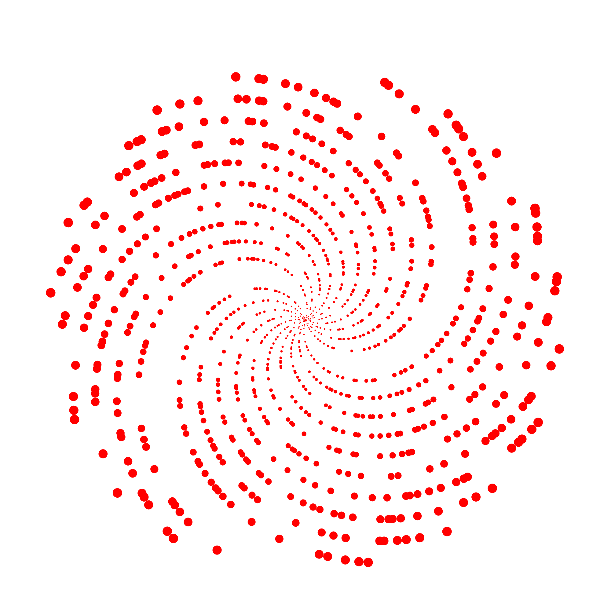

# Beauty of Numbers

> Студия математического искусства: превращает числовые последовательности — в первую очередь простые числа — в изображения.
>
> A math-art studio that turns number sequences — primes first — into images.

Русский | [English ↓](#english)



---

## Русский

### Что это

Beauty of Numbers — десктопное приложение (WPF, .NET 8) для генерации изображений из чисел. Каждое число `n` получает точку на плоскости, а классификатор (простое / составное) задаёт её цвет. Основа проекта — семейство спиральных раскладок: архимедова, Улам, Сакс, гексагональная.

Формула продукта:

**Последовательность × Раскладка × Стиль → Пресет → Экспорт**

### Статус

Ранняя стадия. Работает прототип UI (превью через временный PNG-файл, зум, выбор цветов), консольный пример генерирует один файл. Идёт переход к архитектуре Core / Rendering / Cli / App — см. [roadmap](docs/01-product/roadmap.md).

### Возможности (сейчас)

- Генерация архимедовой спирали `r = n`, `θ = n` для последовательностей до 100 000 чисел.
- Подсветка простых чисел отдельным цветом.
- WPF-UI: выбор цветов, размера точек, зум и панорамирование превью, сохранение PNG.
- Консольный пример: `GeneratePrimes(80 000)` → PNG.

### Быстрый старт

Требуется .NET 8 SDK.

```powershell
dotnet build PrimeSpiralVisualizer.sln
dotnet run --project PrimeSpiralVisualizerUI   # студия (WPF)
dotnet run --project PrimeSpiralVisualizer     # консольный пример, PNG в рабочей папке
```

### Структура репозитория

| Путь | Назначение |
| --- | --- |
| `SpiralMaker/` | библиотека: раскладка точек и экспорт PNG (OxyPlot + SkiaSharp) |
| `PrimeSpiralVisualizer/` | консольный пример генерации |
| `PrimeSpiralVisualizerUI/` | WPF-студия (MVVM) |
| `docs/` | документация: от продукта до математики |

### Документация

- [Продукт: видение](docs/01-product/vision.md)
- [Сценарии использования](docs/01-product/use-cases.md)
- [Дорожная карта](docs/01-product/roadmap.md)
- [Вне рамок проекта](docs/01-product/non-goals.md)
- [Глоссарий](docs/01-product/glossary.md)
- [Архитектура](docs/02-architecture/overview.md)
- [Как собрать и запустить](docs/03-guides/build-and-run.md)
- [Математика раскладок](docs/04-math/layouts.md)
- [Полный индекс документации](docs/README.md)

### Лицензия

Пока не выбрана — планируется в вехе M0 ([roadmap](docs/01-product/roadmap.md)).

---

## English

### What it is

Beauty of Numbers is a desktop WPF app (.NET 8) that renders number sequences as images. Each number `n` becomes a point; a classifier (prime / composite) picks its color. The core idea is a family of spiral layouts: Archimedean, Ulam, Sacks, hexagonal.

Product formula:

**Sequence × Layout × Style → Preset → Export**

### Status

Early stage. A UI prototype works (PNG-file-based preview, zoom, color picking); a console sample renders a single file. Migration to the Core / Rendering / Cli / App architecture is in progress — see the [roadmap](docs/01-product/roadmap.md).

### Quick start

Requires .NET 8 SDK.

```powershell
dotnet build PrimeSpiralVisualizer.sln
dotnet run --project PrimeSpiralVisualizerUI   # WPF studio
dotnet run --project PrimeSpiralVisualizer     # console sample, PNG in the working directory
```

### Documentation

Documentation is written in Russian, with this README kept bilingual. Start with the [docs index](docs/README.md).
