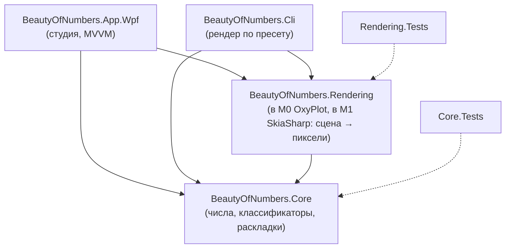
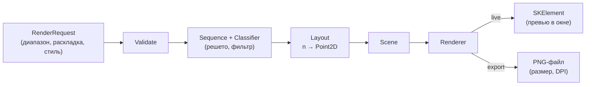

# Обзор архитектуры

Статус: структура M0 внедрена (`src/Core`, `Rendering`, `Cli`, `App.Wpf`, `tests/`); описанное ниже — целевое состояние для M1+. В M0 рендер временно работает на OxyPlot, зависимость удаляется в M1 ([ADR-0002](adr/0002-skiasharp-renderer.md)).

## Принципы

1. **Зависимости направлены внутрь.** Ядро не знает ни про WPF, ни про SkiaSharp, ни про файлы. Рендер знает про ядро. Приложения знают про всех.
2. **Один пайплайн — два вывода.** Превью и экспорт идут через один и тот же рендер: различаются только целевая поверхность и разрешение.
3. **Данные неизменяемы.** Запросы, сцены и стили — иммутабельные record-типы; изменения параметров порождают новый запрос.
4. **Отмена и прогресс — часть контракта,** а не украшение. Каждый долгий этап принимает `CancellationToken` и умеет докладывать о ходе.
5. **Никаких временных файлов для превью.**

## Компоненты

| Проект | Тип | Ответственность |
| --- | --- | --- |
| `BeautyOfNumbers.Core` | `net8.0` | Диапазоны, классификаторы простоты, раскладки, модель сцены, стиль, модель пресета, валидация. Ноль внешних зависимостей. |
| `BeautyOfNumbers.Rendering` | `net8.0` | Построение сцены из запроса, отрисовка, кодирование PNG, потоки прогресса. В M0 — `OxyPlotSpiralRenderer` (временный), в M1 — SkiaSharp. |
| `BeautyOfNumbers.Cli` | `net8.0` | Аргументы, чтение пресета, вызов рендера, коды возврата. |
| `BeautyOfNumbers.App.Wpf` | `net8.0-windows` | Окно, MVVM, Skia-превью, зум/панорама, диалоги, хранение пресетов. |
| `BeautyOfNumbers.Core.Tests` | `net8.0` | Юнит-тесты ядра. |
| `BeautyOfNumbers.Rendering.Tests` | `net8.0` | Смоук- и детерминизм-тесты рендера. |

## Пайплайн

- **Validate** — проверка запроса до тяжёлых вычислений; возвращает список ошибок, а не исключения.
- **Sequence + Classifier** — какие числа берём и как классифицируем; простые считает решето.
- **Layout** — чистая функция `n → (x, y)`; результат — сцена: плоский массив точек с координатами, размером и индексом цвета.
- **Renderer** — превращает сцену в пиксели; группирует точки по цвету и размеру, чтобы рисовать пакетами.
- **Present / Encode** — показ в окне либо кодирование в PNG.

## Потоки выполнения

| Поток | Что делает |
| --- | --- |
| UI-поток WPF | Ввод, команды, отрисовка `SKElement`. Никаких вычислений. |
| Worker (Task) | Валидация, решето, раскладка, построение сцены, кодирование файла. |
| Рендер превью | Выполняется в `PaintSurface` по готовой сцене: только рисование, без математики. |

Правила:

- при быстрых изменениях параметров предыдущая задача отменяется, в очереди остаётся не более одной отложенной перерисовки (debounce 150–250 мс);
- `IProgress<ProgressReport>` сообщает этап и долю; UI показывает реальный прогресс, а не таймер;
- отмена — кооперативная, через `CancellationToken`, проверяется в циклах генерации и раскладки.

## Производительность

| Сценарий | Цель |
| --- | --- |
| Превью 100k точек | ≤ 100 мс на перерисовку |
| Полный рендер 1M точек | ≤ 2 с, UI отзывчив |
| Решето до 10^8 | ≤ 3 с, ≤ 256 МБ |
| Память сцены 1M точек | ≤ 32 МБ (структура точки ≤ 32 байт) |

Приёмы, заложенные в дизайн: решето вместо пробного деления; плоские массивы структур вместо коллекций объектов; батчинг по цвету; квантование размеров точек; отрисовка без антиалиасинга на больших объёмах (переключаемо).

## Ошибки и логирование

- Ошибки пользователя (неверный диапазон, занятый файл, битый пресет) — ожидаемый результат: понятное сообщение, приложение живо.
- Ошибки программиста (нарушенный инвариант) — исключение.
- Молчаливые `catch` запрещены; каждый проглатываемый случай обязан быть обоснован комментарием и попасть в лог.
- Логирование: лёгкий файловый логгер в студии (`%AppData%\BeautyOfNumbers\logs\`). Библиотека выбирается в M1 (открытый вопрос ниже).

## Журнал решений (ADR)

- [ADR-0001. Разделение на Core / Rendering / Cli / App и переименование проектов](adr/0001-core-split-and-rename.md)
- [ADR-0002. Собственный рендер на SkiaSharp вместо OxyPlot](adr/0002-skiasharp-renderer.md)
- [ADR-0003. Живое превью без временных файлов](adr/0003-live-preview-no-temp-files.md)
- [Шаблон ADR](adr/0000-template.md)

## Что переехало из прототипа (M0)

| Сейчас | Куда |
| --- | --- |
| `SpiralMaker/PlotUtils.cs` → `GetCoordinate` | `Core/Layouts/ArchimedeanSpiral` |
| `SpiralMaker/PlotUtils.cs` → `IsPrime` | `Core/Classifiers/ReferencePrimeClassifier` (только тесты; в продакшене — решето) |
| `SpiralMaker/PlotUtils.cs` → построение `PlotModel` и стили | `Rendering` (сцена + отрисовка) |
| `SpiralMaker/PlotUtils.cs` → `SaveToPng` | `Rendering/PngExporter` |
| `PrimeSpiralVisualizer/Program.cs` → `GeneratePrimes` | `Core/Classifiers/SievePrimeClassifier` + `Cli` |
| `MainWindowViewModel.GeneratePrimes` | удаляется, используется ядро |
| `MainWindowViewModel.GenerateAndDisplayImage` (temp-файл) | `App.Wpf` + `Rendering` (live-превью) |
| Прогресс 10/50/80/90 | `ProgressReport` по реальным этапам |
| `PrimeSpiralVisualizerUI/Converters/*` | остаются в `App.Wpf` |

## Открытые вопросы

| Вопрос | Решение |
| --- | --- |
| MVVM-тулкит: свой `RelayCommand` или `CommunityToolkit.Mvvm`? | Решено в M0: остаёмся на своём `RelayCommand` (команд мало, лишняя зависимость не нужна); `CommunityToolkit.Mvvm` пересматриваем в M1 при росте числа команд. |
| Библиотека логирования | Отложено до M1. |
| SVG-экспорт: `Svg.Skia` или собственная запись? | Отложено до M3 после прототипа. |
| Нужен ли DPI в метаданных PNG или достаточно размеров в пикселях? | Решить в M2 по факту использования. |
