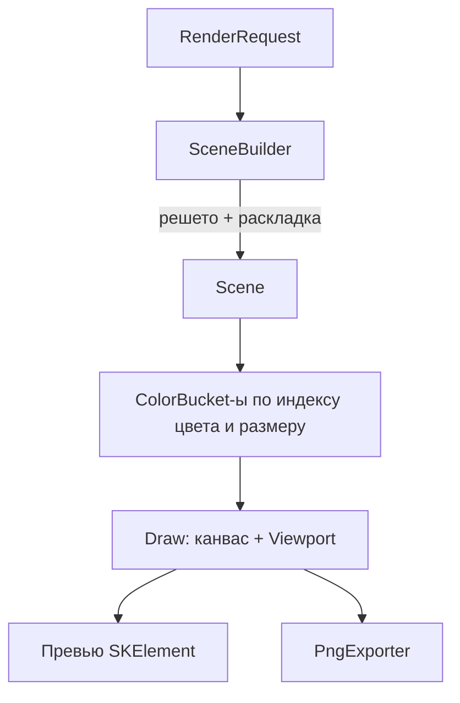

# Рендеринг (BeautyOfNumbers.Rendering)

Статус: целевое состояние (SkiaSharp, M1). В M0 рендер временно работает на OxyPlot (`OxyPlotSpiralRenderer`); зависимость от OxyPlot удаляется в M1 ([ADR-0002](adr/0002-skiasharp-renderer.md)).

## Границы ответственности

Рендер умеет:

- строить сцену из запроса: вызвать решето, прогнать раскладку, посчитать размеры точек, разложить по цветовым индексам;
- рисовать сцену на любой поверхности Skia (`SKCanvas`) при заданном видовом окне;
- кодировать PNG с заданным размером и DPI;
- докладывать о прогрессе и уважать отмену.

Рендер не знает про WPF и окна. `SkiaSharp.Views.WPF` подключается только в приложении, чтобы получить `SKElement`.

## Зависимости

| Пакет | Где | Зачем |
| --- | --- | --- |
| `SkiaSharp` | `Rendering`, `Cli`, `App.Wpf` | Рисование и кодирование PNG. |
| `SkiaSharp.Views.WPF` | только `App.Wpf` | `SKElement` для живого превью. |
| `OxyPlot.SkiaSharp` | `Rendering` | Временно в M0 (`OxyPlotSpiralRenderer`); удаляется в M1 ([ADR-0002](adr/0002-skiasharp-renderer.md)). |

## Пайплайн



### SceneBuilder

```csharp
public sealed class SceneBuilder
{
    public SceneBuilder(IPrimeClassifier primes);

    public Scene Build(
        RenderRequest request,
        CancellationToken cancellationToken,
        IProgress<ProgressReport>? progress = null);
}
```

- Итерирует диапазон один раз; классификация — O(1) по решету.
- Считает координаты раскладки и размер точки; пишет в заранее выделенный массив `ScenePoint[]` (длина известна из `Range.Count`).
- Собирает границы `MinX..MaxX`, `MinY..MaxY` для авто-масштаба.
- Отмена проверяется каждые N тысяч точек (например, 16 384), чтобы не платить за проверку на каждой.
- Прогресс этапов: `Sieve` (0–0.3), `Layout` (0.3–0.8), `Render` (0.8–0.95), `Encode` (0.95–1.0). Доли — ориентир, уточняются в M1.

### Отрисовка

```csharp
public interface ISceneRenderer
{
    void Draw(SKCanvas canvas, Scene scene, RenderStyle style, Viewport viewport);
}

public readonly record struct Viewport(double Scale, double OffsetX, double OffsetY);
```

- **Единый рендер для превью и экспорта.** Превью — канвас размера окна; экспорт — канвас заданных пикселей. Математика отрисовки одна.
- **Мировые координаты → экран:** сцена рисуется в своих координатах (как их вернула раскладка: полярные раскладки дают `x = r·cos θ`, `y = r·sin θ`), затем применяется `Viewport`. Y-ось инвертируется один раз, в рендере, а не в раскладке.
- **Батчинг:** точки группируются по `(ColorIndex, размер)`. Размеры квантуются (например, 16 ступеней), чтобы рисовать одним `DrawPoints` на группу. Малые объёмы (до ~200k) допустимо рисовать `DrawCircle`, если визуально лучше; порог настраивается и измеряется бенчмарком.
- **Отсечение:** точки за границами видового окна не рисуются (быстрая проверка по координатам до вызова Skia).
- **Антиалиасинг:** управляется стилем; для миллионов точек по умолчанию выключен.

### Экспорт PNG

```csharp
public static class PngExporter
{
    public static void Export(
        Scene scene,
        RenderStyle style,
        OutputOptions output,
        string filePath,
        CancellationToken cancellationToken);
}
```

- `OutputOptions.Width/Height` — реальные пиксели; `Dpi` — метаданные.
- Никаких «figsize × 100» и захардкоженного `Dpi = 300`.
- Ошибки записи (нет прав, занятый файл) — ожидаемые: понятное исключение/результат, не молчаливый `return false`.
- Детерминизм: одинаковый запрос + одинаковая версия рендера → идентичные пиксели. Никаких случайностей и неявных зависимостей от времени/размера окна.

### Превью

- `SKElement` получает готовую `Scene` и текущий `Viewport`.
- `PaintSurface` только рисует: математика не выполняется в UI-потоке.
- Панорама/зум меняют `Viewport` и вызывают перерисовку; сцена и решето не пересчитываются.
- Смена «тяжёлых» параметров (диапазон, раскладка, стиль) перестраивает сцену в фоне; смена видового окна — мгновенная.

## Производительность

| Приём | Эффект |
| --- | --- |
| Плоский `ScenePoint[]` | Нет аллокаций на точку, локальность памяти. |
| Батчинг по цвету и размеру | Тысячи точек за один вызов Skia. |
| Решето вместо пробного деления | `10^6` чисел — миллисекунды. |
| Отсечение вне видового окна | Стоимость превью зависит от видимого, а не от всего диапазона. |
| Квантование размеров | Убирает тысячи уникальных `SKPaint`. |
| Отмена и debounce в UI | Не тратим ресурсы на устаревшие запросы. |

Бенчмарки (M1): 100k, 1M, 10M точек; фиксируем время `SceneBuilder.Build` и `Draw` отдельно.

## Не входит

- Оси, сетки, легенды, подписи чисел: старый `showAnnot` и `OxyPlot`-оформление не переносятся. Подписи — возможная фича M3+, решаемая отдельной задачей (производительность подписей — главный риск).
- SVG/PDF — M3.
- Параллельная отрисовка — только если бенчмарки покажут необходимость; интерфейс рендера не запрещает тайлинг позже.

## Тестирование

- Смоук: сцена на 10k точек рисуется без исключений в канвас 512×512.
- Детерминизм: два прогона дают одинаковый хэш пикселей.
- Пустая сцена (0 точек) и сцена из одной точки — не падают.
- Отмена: `Build` с уже отменённым токеном бросает `OperationCanceledException` быстро.
- Экспорт: файл создаётся, размеры совпадают с `OutputOptions`.
